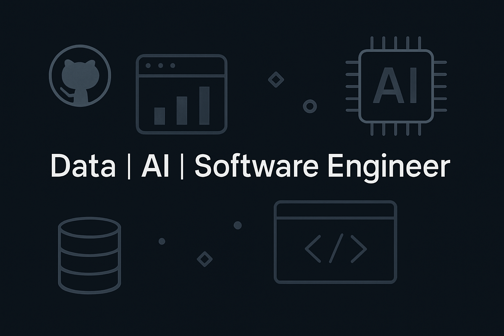

# Hi there, I'm Matt 👋

## About Me

  Passionate about building intelligent systems and extracting valuable insights from data. I thrive on solving complex problems at the intersection of software and data engineering.

  My expertise lies in Python development, particularly in data environments using technologies like SQL, PySpark, and PostgreSQL. I'm also deeply interested in Machine Learning and Artificial Intelligence, constantly exploring how to leverage these fields to create innovative solutions.

  In addition to my data focus, I have experience in web development with JavaScript and Next.js, which allows me to build full-stack applications and data visualization tools.

---

## Skills

### Programming Languages

### Data Technologies

### AI / Machine Learning

### Web Development

---

## GitHub Stats

---

## Featured Projects

### [Project Name 1](link_to_project_repo)
A brief description of Project 1. Mention the key technologies used (e.g., Python, PySpark, ML model).
### [Project Name 2](link_to_project_repo)
A brief description of Project 2. Mention the key technologies used (e.g., Next.js, JavaScript, PostgreSQL).
---

## Connect with Me

---

Thanks for stopping by! 😊

